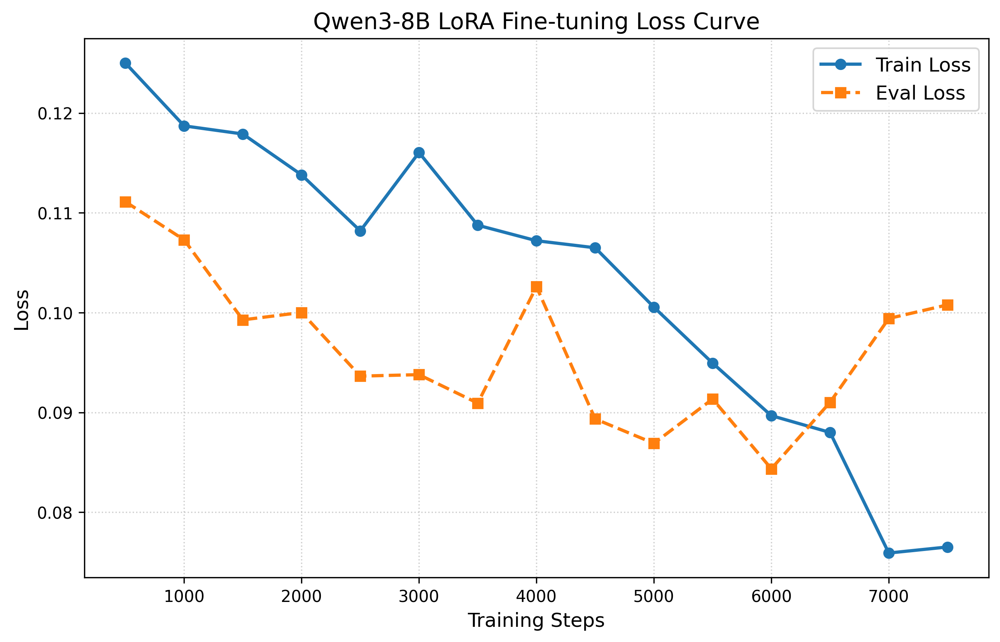
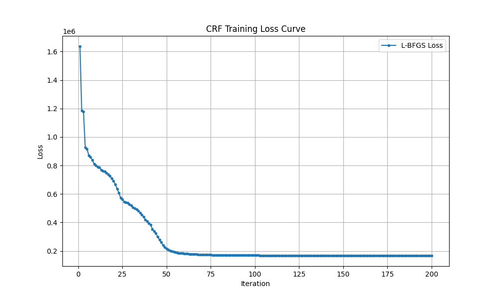

## 分词模型训练

### 文件结构

```
modelTrain/
├── data/
|   ├── train.jsonl     # 训练数据：每行一个JSON对象，包含文本和标签
|   ├── dev.jsonl       # 验证数据：同训练数据格式
|   └── test.jsonl      # 测试数据：同训练数据格式
├── data_preparation.py # 数据准备：从原始文本构建训练数据，包含正负样本生成
├── modelTest.py        # 模型测试：加载模型，在测试集上评估性能
├── trainQwen8b.py      # LoRA微调训练
├── trainCFR.py         # CFR训练
└── loraTest.py         # LoRA训练后模型测试
```

### 训练流程

- 数据准备：运行`data_preparation.py`，从原始文本构建训练数据
  - 按0.8:0.1:0.1划分训练集、验证集和测试集
  - 数据示例：`{"instruction": "请对下面的古典诗词文本进行中文分词，要求如下。0. 总体原则：根据句意；应分尽分；实事求是；合并词、分短语。1. 功能词、虚词（如“或、又、无、兮、其、乃、遂、也、矣”等副词、连词、语气词、否定词）应尽量单独成词。2. 语义紧密、习惯搭配或专有名词的词组可以合并成多字词3. 有些地方的分词可能存在多种合理的方案，请你选择最符合句意表达的那一项。4. 不允许增删、更改任何汉字，只比较不同的切分位置；不可机械追求最长词或最多单字，每个词包含字数一般最好不超过4个。5. 诗句里面重要的地名、人名、专有名词、固定短语，应当合并成词要求保持原文字符不增不删，不添加解释，只输出分词结果，词语之间用“|”分隔。", "input": "至樂三靈會，", "output": "至|樂|三靈|會"}`
- LoRA微调训练
  - 选取模型：Qwen3-8b
  - 训练脚本：`trainQwen8b.py`
  - 服务器配置：RTX4090，4*24GB显存，44vCPU，240G内存
  - 参数量：trainable params: 21,823,488 || all params: 8,212,558,848 || trainable%: 0.2657
  - 训练时长：约100小时
  - 训练配置
  ```python
  MAX_LENGTH = 512
  NUM_TRAIN_EPOCHS = 2
  LEARNING_RATE = 2e-4
  PER_DEVICE_TRAIN_BATCH_SIZE = 1 
  PER_DEVICE_EVAL_BATCH_SIZE = 1
  GRADIENT_ACCUMULATION_STEPS = 16
  LORA_RANK = 8  
  LORA_ALPHA = 16  
  LORA_DROPOUT = 0.05
  LOGGING_STEPS = 20
  SAVE_STEPS = 500  
  EVAL_STEPS = 500 
  lora_config = LoraConfig(r=LORA_RANK, lora_alpha=LORA_ALPHA,
  lora_dropout=LORA_DROPOUT, bias="none", task_type="CAUSAL_LM",
  target_modules=["q_proj", "k_proj", "v_proj", "o_proj",
  "gate_proj", "up_proj", "down_proj",],)
  ```
  - 训练过程：
    |step|train_loss|eval_loss|
    |---|---|---|
    |500|0.125004|0.111114|
    |1000|0.118711|0.107293|
    |1500|0.117897|0.099275|
    |2000|0.113801|0.100016|
    |2500|0.108190|0.093640|
    |3000|0.116042|0.093785|
    |3500|0.108757|0.090932|
    |4000|0.107203|0.102595|
    |4500|0.106497|0.089350|
    |5000|0.100549|0.086904|
    |5500|0.094943|0.091347|
    |6000|0.089679|0.084353|
    |6500|0.087996|0.091017|
    |7000|0.075915|0.099414|
    |7500|0.076520|0.100779|
  - 损失下降曲线：
    
  - 训练结果：`qwen3-8b-poem-seg-lora\`
- CFR训练
  - 训练脚本：`trainCFR.py`
  - 训练配置
    ```python
    crf = sklearn_crfsuite.CRF(
        algorithm="lbfgs",  
        c1=0.1,  
        c2=0.1,  
        max_iterations=200,
        all_possible_transitions=True, 
        verbose=True,
    )
    ```
  - 训练过程：
  
  - 训练结果：`crfModel/crf_poem_seg.pkl`
    - 最终测试集precision: 0.7915, recall: 0.8076, f1: 0.7995, exact_match: 0.5403
    - 错误数据示例
      ```python
      text: 香嚴童子沈薰鼻
      gold: 香嚴|童子|沈|薰|鼻
      pred: 香|嚴|童子|沈|薰|鼻

      text: 心旆摇摇不可降
      gold: 心|旆|摇摇|不可|降
      pred: 心旆|摇摇|不可|降

      text: 科場久廢不曾開
      gold: 科場|久|廢|不曾|開
      pred: 科|場|久|廢|不曾|開
      ```

### 评测

- 自行构造包含一百句古诗的评测数据集`test.txt`，包含一般诗句、地名、人名、固定短语等多种情况，难度较大。
  - 1-40为一般诗句
  - 41-60为包含地名的诗句
  - 61-80为包含人名的诗句
  - 81-100为包含特定典故的诗句

```csv
category,input,answer
一般,宁为百夫长,宁|为|百夫|长
一般,人归落雁后,人|归|落雁|后
一般,沈腰潘鬓销磨,沈腰潘鬓|销磨
一般,鸟飞反故乡兮,鸟|飞|反|故乡|兮
人名,吾爱孟夫子,吾|爱|孟夫子
人名,独有霍嫖姚,独|有|霍嫖姚
人名,清新庾开府,清新|庾开府
人名,司马相如适被申,司马相如|适|被|申
人名,宇文新州之懿范,宇文新州|之|懿范
地名,封狼居胥,封|狼居胥
地名,哀哀明月楼,哀哀|明月楼
地名,还归细柳营,还|归|细柳营
地名,只有敬亭山,只有|敬亭山
地名,白帝城中云出门,白帝城|中|云|出门
典故,今同萇弘血,今|同|萇弘|血
典故,莫学班超投笔,莫|学|班超|投笔
典故,隔江犹唱后庭花,隔江|犹|唱|后庭花
典故,柳暗花明又一村,柳暗花明|又|一|村
典故,到乡翻似烂柯人,到|乡|翻|似|烂柯人
```

- 选取分词方法：MM（正向最大匹配），BMM（逆向最大匹配），jieba, CFR，Qwen3-8b, Qwen3-8b-LoRA, deepseek, Gemini
- 评测结果
  - \[MM\] 句正确率: 42.00% | 词正确率: 67.36%
  - \[BMM\] 句正确率: 42.00% | 词正确率: 67.36%
  - \[CRF\] 句正确率: 37.00% | 词正确率: 68.93%
  - \[jieba\] 句正确率: 35.00% | 词正确率: 53.52%
  - \[DeepSeek\] 句正确率: 64.00% | 词正确率: 80.16%
  - \[Gemini\] 句正确率: 75.00% | 词正确率: 85.90%
  - \[QwenBase\] 句正确率: 24.00% | 词正确率: 66.32%
  - \[QwenLoRA\] 句正确率: 56.00% | 词正确率: 78.07%